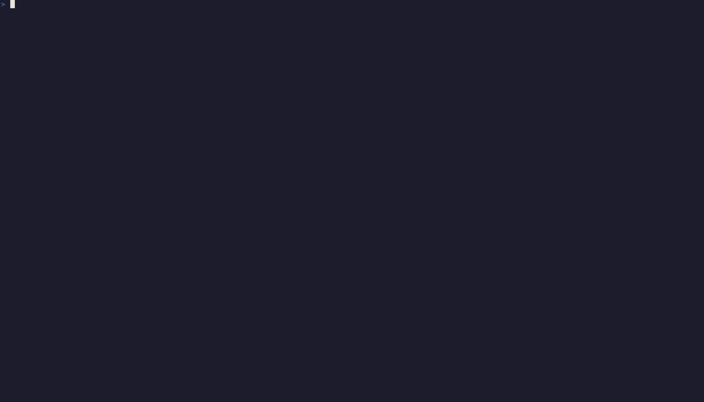

# Calcio Manager

A terminal-based football management simulation inspired by **Championship Manager 01/02**, set in the world of Italian amateur **7-a-side football (CSI)**.

Built with [Textual](https://textual.textualize.io/) for a rich TUI experience.

## Demo



> Recorded with [VHS](https://github.com/charmbracelet/vhs). Re-record with `vhs demo.tape`.

## Features

- **Career mode** — pick any of Italy's 7,900+ comuni, customize your team, and start an indefinite career
- **New game wizard** — multi-step setup: Regione > Provincia > Comune, team name, social colors, stadium name
- **Multi-girone tournaments** — dynamic group structure (6-10 teams per group) based on province size, with realistic team names
- **Team management** — manage your amateur squad, pick formations, handle player roles
- **Match simulation** — watch games unfold with real-time commentary (in Italian)
- **League system** — compete in a full CSI-style season with calendar, standings, and results
- **Season transitions** — at the end of each season a new championship is generated automatically
- **Player generation** — procedurally generated players with Italian names and realistic attributes
- **Weather system** — dynamic weather affecting match conditions (tuned for each month)
- **Save/Load** — persist your career across sessions
- **Internationalization** — Italian (full) and English (partial) support via TOML locale files

## Requirements

- Python 3.12+
- [uv](https://docs.astral.sh/uv/) (recommended package manager)

## Getting Started

```bash
# Clone the repo
git clone https://github.com/thesmokinator/calcio-manager.git && cd calcio-manager

# Install dependencies
uv sync

# Run the game
uv run calcio-manager
```

## Development

```bash
# Install dev dependencies
uv sync --all-groups

# Run linter
uv run ruff check src/ tests/

# Run type checker
uv run mypy --strict src/

# Run tests
uv run pytest
```

## Project Structure

```
src/calcio_manager/
├── models/        # Pydantic data models (player, team, match, season, ...)
├── engine/        # Game logic (match sim, player gen, calendar, tournament, season, ...)
├── state/         # Game state management and save/load
├── data/          # Italian comuni database, locale files, commentary, art assets
└── ui/
    ├── screens/   # Textual screens (wizard, game hub, live match, ...)
    ├── widgets/   # Reusable UI components
    └── styles/    # Textual CSS
```
